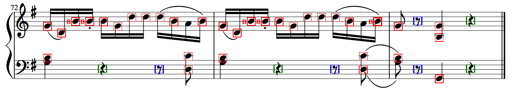
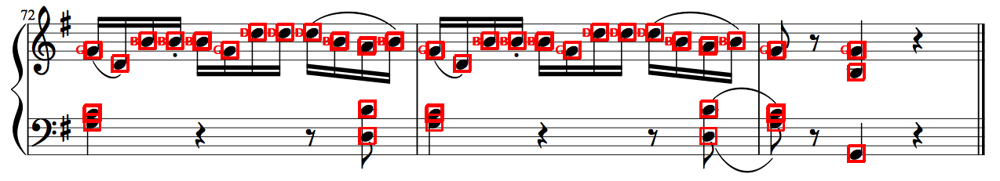
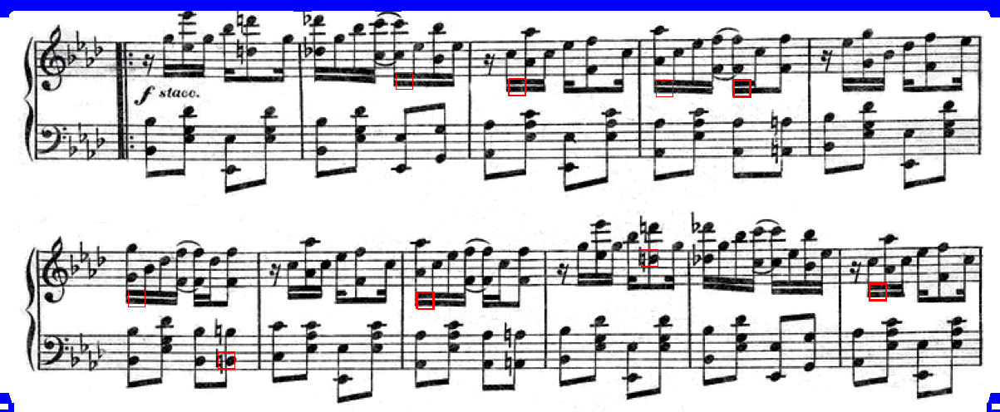
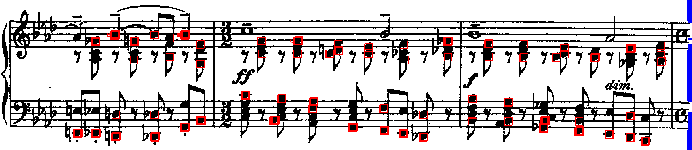
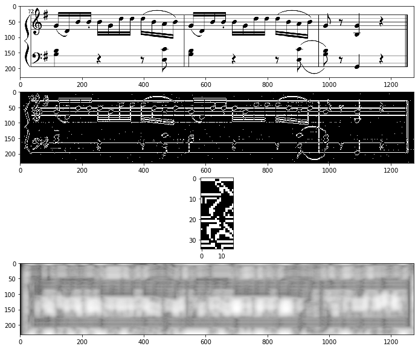
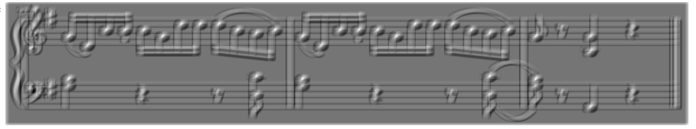
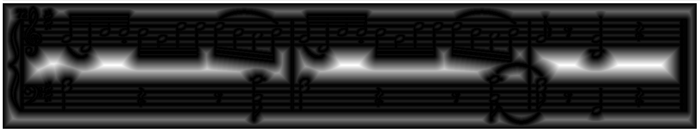

# Optical Musical Detection from Musical Sheets 
**To run:**
`python3 omr.py <image>`

**Results**  
- The implementation works quite well for the cleanest test image `music1`.

- It is able to detect the locations of most of the notes correctly, given that the image has a single set of staves.
- Our program detects the notes correctly on the images on which there are 2 set of staves. If the image has multiple sets of staves, the current Hough transform implementation fails and reports incorrect spacing, which results in improper resizing of the template image and thus failures in detection of notes.
- It is able to detect both type of rests in the first test image `music1`.
- It is able to identify some of the pitches. This is the case because the notion of confidence percentages in case of pitch detection has not yet been introduced. Currently, it only identifies the pitches that it is fully confident about. 

Without the confidence percentage, it tries to plot every possible match and it manages to identify the pitches. Due to the introduction of the confidence percentage, now it plots the bounding boxes only at positions it is very certain of, and hence is not able to detect the pitch. The performance will improve significantly if the notion of confidence percentage is introduced for pitch detection as well.

**When does it work well?**  
- The accuracy depends on the crispness and clarity of the staves, and the rests in the picture. 
- It works well when the image contains just a single pair of staves. 

**Limitations**  
- The current implementation of Hough transform detects a pair of staves. So the algorithm fails to detect anything on picture with multiple pairs of staves.

- The algorithm doesn't perform well when the notes are occluded (like in `music4`).

- The template for both the rests contains staves. The current implementation fails to detect any rests that don't have staves in the background.

PS: The false positives due to the rests have been handled in the code but we were not able to generate newer images due to time constraints and the long feedback cycle of our implementation.

**Improvements and Future Scope**
- The implementation of Hough transform can be generalized to detect multiple staves.
- Another approach to achieve the same outcome can be to break down the image containing multiples staves into sections such that each section has a pair of staves and run the current implementation of Hough transform and then merge the results.
- Currently, confidence percentages are only assigned for the detection of the notes. The same idea can be extended and confidence percentages can be introduced for rests and for pitch detection, which currently make a hard decision.
- The end-to-end detection process is slow. The code can be profiled to check for bottlenecks. Another approach would be to try and precompute things if possible.

**Things we tried:**   
- **Implemented convolution using fourier and cross-correlation:**
With Convolution using cross-correlation, the results were quite clean for edge detection (using sobel). Since we needed the size of kerrnal and image same to perform multiplication in fourier space, we padded the kernel with 0's. We also padded 0's in both image and kernel to make their size as 2^n to perform FFT. After comparing the results of convolution using cross correlation and fourier, we found out that, with fourier transform they were a bit noisy, we could see a lot of high frequency points along with edges. Therefore, we decided to go with convolution using cross-corelation.

- **Improving template matching for rests**  
Since the template of the rests contain staves, the current implementation fails to detect rests without staves. An approach that we tried was to use the vertical edge map of the template to perform the matching. The results were rather poor and we had to ditch the idea.

- **Template Matching (Point 5 in Assignment):** 
Apart from the approaches mentioned in the assignment to calculate the Hamming distance, we tried an alternative and intuitive way to find a metric to compare the similarities.  
We subtracted the pixel intensities of the template from the image area, and converted all values below a chosen threshold to 1 and all values above threshold to zero. The value of threshold was calculated in such a way that the intensity of the two regions are similar. We added all the 1 values and that became the count of how well the template matched the image area and assigned that value to the first pixel in the region.  After calculating it for all the neighbourhoods, we chose how well the template matched the image area via some threshold and chose those neighborhoods. But since, this method did not perform well for template 2 and 3, we went ahead with Hamming distance.

 
 - **Template Matching (Point 6 in Assignment):** 
We implemeneted both point 5 and point 6 to compare the results. For point 6, after performing the edge detection on both image and template, we calculated the distance matrix on image to find the closest edge for every pixel and the performed the convolution of it with template edge map.

 
- **Alternate way to find the similarity function:**    
We calculated the Euclidean distance of each pixel from the edge in both template and the image. Then we subtracted this distance, and set a threshold and all the points lying within that threshold we calculated the similarity. The results obtained were better than the hamming distance results, but not well enough.  
In another approach, we pre-computed the euclidean distance to save us the computation time, and this reduced the loops in the program.
